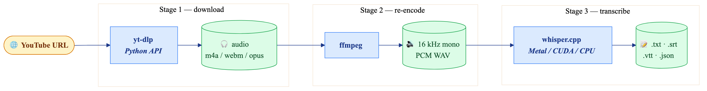
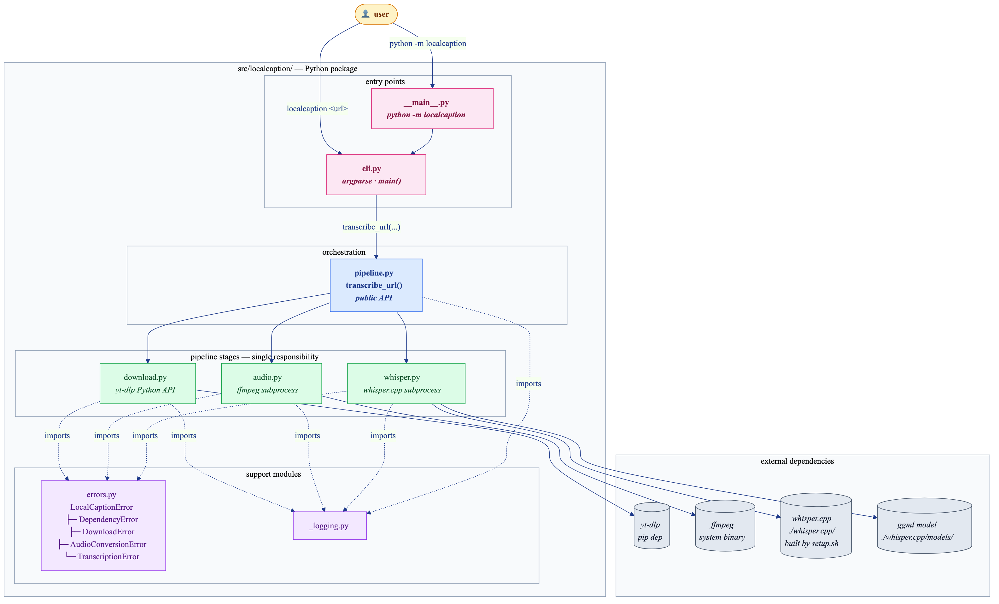
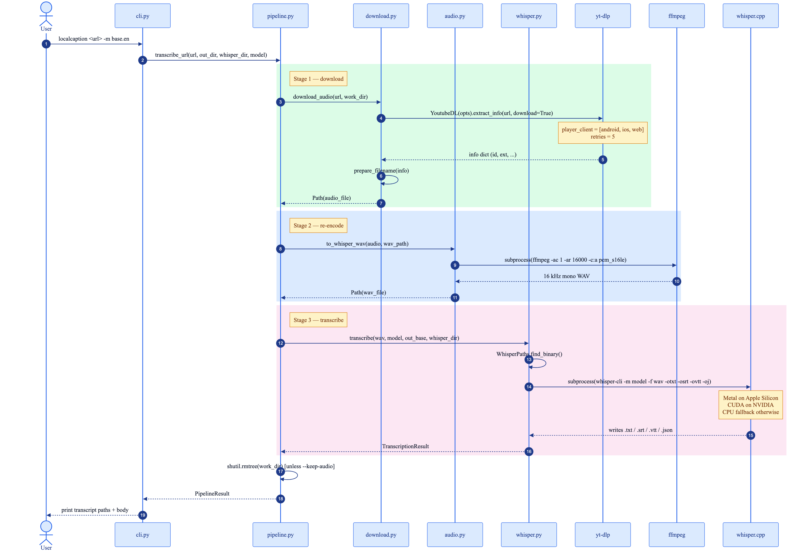

# localcaption

> Paste a YouTube URL, get a transcript. **Fully local, no API keys.**

[](https://github.com/jatinkrmalik/localcaption/actions/workflows/ci.yml)
[](LICENSE)
[](pyproject.toml)
[](https://github.com/astral-sh/ruff)

`localcaption` is a tiny orchestrator over three battle-tested tools:

| Stage | Tool |
|---|---|
| Download bestaudio | [`yt-dlp`](https://github.com/yt-dlp/yt-dlp) |
| Re-encode to 16 kHz mono WAV | [`ffmpeg`](https://ffmpeg.org/) |
| Transcribe locally | [`whisper.cpp`](https://github.com/ggerganov/whisper.cpp) |

Nothing is uploaded to a third-party service. No OpenAI / Google / DeepL keys
required. Runs happily on a laptop.



## Install

### Prerequisites

- Python 3.10+
- `git`, `ffmpeg`, `cmake` on your `$PATH`
  (macOS: `brew install ffmpeg cmake`)

### One-shot setup

```bash
git clone https://github.com/jatinkrmalik/localcaption
cd localcaption
./scripts/setup.sh
source .venv/bin/activate
```

This will:

1. Create `.venv/` and pip-install `localcaption` in editable mode.
2. Clone & build `whisper.cpp` into `./whisper.cpp/`.
3. Download the default `base.en` ggml model.

Override the default model with `WHISPER_MODEL=small.en ./scripts/setup.sh`.

## Usage

### CLI

```bash
localcaption "https://www.youtube.com/watch?v=dQw4w9WgXcQ"
```

| flag | default | what it does |
|---|---|---|
| `-m`, `--model` | `base.en` | whisper model name (`tiny.en`, `base.en`, `small.en`, `medium.en`, `large-v3`, …) |
| `-o`, `--out` | `./transcripts` | output directory |
| `-l`, `--language` | `auto` | ISO language code, or `auto` to let whisper detect it |
| `--whisper-dir` | `./whisper.cpp` | path to a built whisper.cpp checkout (env: `LOCALCAPTION_WHISPER_DIR`) |
| `--keep-audio` | off | keep the downloaded audio + intermediate WAV in `<out>/.work/` |
| `--no-print` | off | don't echo the transcript to stdout |

Outputs `<videoId>.txt`, `.srt`, `.vtt`, and `.json` in the chosen directory.

You can also invoke it as a module: `python -m localcaption <url>`.

### Python API

```python
from pathlib import Path
from localcaption.pipeline import transcribe_url

result = transcribe_url(
    "https://www.youtube.com/watch?v=dQw4w9WgXcQ",
    out_dir=Path("transcripts"),
    whisper_dir=Path("whisper.cpp"),
    model="base.en",
)
print(result.transcripts.txt.read_text())
```

## Architecture

`localcaption` is intentionally tiny: an orchestrator (`pipeline.py`) drives
three single-responsibility stages, each wrapping one external tool. The
modules are split this way so that a contributor can swap, say, `whisper.cpp`
for `faster-whisper` without touching `download.py` or `audio.py`.

### Module map



| Layer | Files | Responsibility |
|---|---|---|
| Entry points | `cli.py`, `__main__.py` | argparse, exit codes, stdout formatting |
| Orchestration | `pipeline.py` | public Python API: `transcribe_url(...)` |
| Pipeline stages | `download.py`, `audio.py`, `whisper.py` | one external tool each |
| Support | `errors.py`, `_logging.py` | exception hierarchy, tiny logger |

### Runtime sequence

End-to-end call flow for a single `localcaption <url>` invocation, including
the subprocess hops to yt-dlp, ffmpeg, and whisper.cpp. The intermediate
`.work/` directory is cleaned up at the end unless `--keep-audio` is passed.



> Diagrams live in [`docs/diagrams/`](docs/diagrams) as Mermaid `.mmd` source
> files alongside the rendered PNGs. Regenerate with:
> ```bash
> mmdc -i docs/diagrams/<name>.mmd -o docs/diagrams/<name>.png \
>   -t default -b transparent --width 1600 --scale 2
> ```

## Benchmarks

Wall-clock times for the **complete** pipeline (yt-dlp download → ffmpeg
re-encode → whisper.cpp transcription), measured with the default `base.en`
model. Numbers will vary with your network speed and CPU/GPU; treat them as
order-of-magnitude reference, not a competitive benchmark.

| Video | Length | Wall-clock | Speed vs. realtime | Hardware |
|---|---|---|---|---|
| [TED-Ed — *How does your immune system work?*](https://www.youtube.com/watch?v=PSRJfaAYkW4) | 5:23   | **7.5 s**  | ~43× | MacBook Pro M4 Pro, 48 GB |
| [3Blue1Brown — *But what is a Neural Network?*](https://www.youtube.com/watch?v=aircAruvnKk) | 18:40  | **19.3 s** | ~58× | MacBook Pro M4 Pro, 48 GB |
| [Hasan Minhaj × Neil deGrasse Tyson — *Why AI is Overrated*](https://www.youtube.com/watch?v=BYizgB2FcAQ) | 54:17 | **49.8 s** | ~65× | MacBook Pro M4 Pro, 48 GB |

<details>
<summary>Reproduce</summary>

```bash
# Apple Silicon, macOS, whisper.cpp built with Metal,
# model: ggml-base.en, language: auto, no other heavy processes.

time localcaption --no-print -o /tmp/lc-bench-1 \
  "https://www.youtube.com/watch?v=PSRJfaAYkW4"

time localcaption --no-print -o /tmp/lc-bench-2 \
  "https://www.youtube.com/watch?v=aircAruvnKk"

time localcaption --no-print -o /tmp/lc-bench-3 \
  "https://www.youtube.com/watch?v=BYizgB2FcAQ"
```

If you'd like to contribute numbers from a different machine (Linux + CUDA,
Windows + WSL, x86 macOS, etc.), open a PR adding a row above with your
hardware in the **Hardware** column.
</details>

## Notes

- Bigger models = better quality but slower. `base.en` is a good default;
  try `small.en` if you have the patience and `tiny.en` for instant results.
- Apple Silicon: whisper.cpp's CMake build uses Metal automatically — you'll
  see `ggml_metal_init` in the logs.
- The pipeline accepts any URL `yt-dlp` supports (Vimeo, Twitch VODs, podcast
  pages, etc.), not just YouTube.
- If you hit `HTTP 403 Forbidden`, your `yt-dlp` is probably stale —
  `pip install -U yt-dlp` usually fixes it.

## Roadmap

The roadmap lives on GitHub Issues so it's easy to track, comment on, and
contribute to:

👉 **[Open roadmap items](https://github.com/jatinkrmalik/localcaption/issues?q=is%3Aissue+is%3Aopen+label%3Aroadmap)**

A snapshot of what's planned (click through for full descriptions, acceptance
criteria, and discussion):

| # | Item | Labels |
|---|---|---|
| [#1](https://github.com/jatinkrmalik/localcaption/issues/1) | Switch default model from `base.en` to `small.en` | `good first issue` |
| [#2](https://github.com/jatinkrmalik/localcaption/issues/2) | Batch mode (`--batch urls.txt`) | `enhancement` |
| [#3](https://github.com/jatinkrmalik/localcaption/issues/3) | Local auto-summary via Ollama (`--summary`) | `enhancement` |
| [#4](https://github.com/jatinkrmalik/localcaption/issues/4) | Speaker diarization with pyannote.audio (`--diarize`) | `stretch`, `help wanted` |
| [#5](https://github.com/jatinkrmalik/localcaption/issues/5) | YouTube chapters & grep-able search index | `enhancement` |
| [#6](https://github.com/jatinkrmalik/localcaption/issues/6) | Pluggable transcription backends (faster-whisper / MLX) | `help wanted` |

**Have an idea?** Open a
[feature request](https://github.com/jatinkrmalik/localcaption/issues/new/choose) —
or jump into [Discussions](https://github.com/jatinkrmalik/localcaption/discussions)
if you want to chat about it first.

## Related projects

`localcaption` deliberately stays tiny. If you want more, check out:

- [`whishper`](https://github.com/pluja/whishper) — full web UI for local
  transcription with translation and editing.
- [`transcribe-anything`](https://github.com/zackees/transcribe-anything) —
  multi-backend, Mac-arm optimised, supports URLs.
- [`WhisperX`](https://github.com/m-bain/whisperX) — word-level timestamps and
  diarisation on top of openai-whisper.

## Contributing

Pull requests welcome — see [CONTRIBUTING.md](CONTRIBUTING.md). By
participating you agree to abide by our
[Code of Conduct](CODE_OF_CONDUCT.md).

## License

[MIT](LICENSE).
